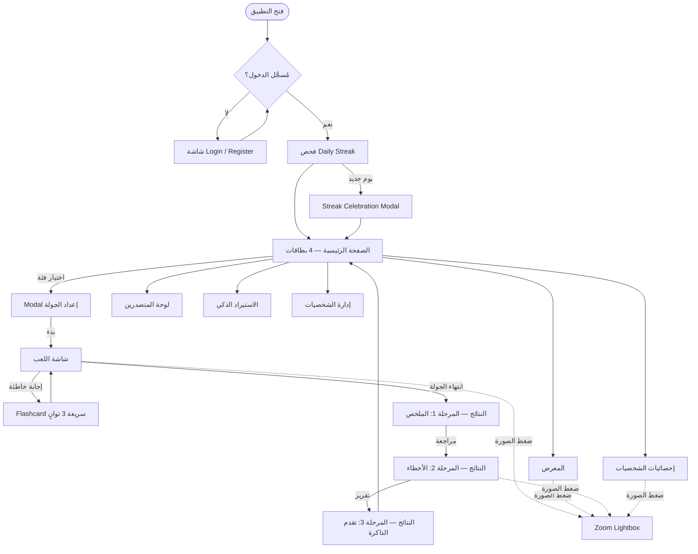

# 🎮 وثيقة الخطة الشاملة لمشروع لعبة تخمين الشخصيات (Master Plan)

**Project:** Celebrity Guessing Game (Trans / Sluts / Twinks / Mix)  
**Architecture:** SPA (Vanilla JS) + Cloudflare Pages + Pages Functions + D1 + KV Cache  
**Auth:** Username / Password — Server-side sessions via secure HttpOnly Cookies  
**Data Model:** Shared Characters • Per-User Game Stats & Mastery  
**Design System:** Ultra-Premium Dark Theme with Vibrant Neon/Glow Accents  

---

## 📑 فهرس المحتويات

1. [نظرة عامة على المشروع](#1-نظرة-عامة-على-المشروع)
2. [البنية التقنية الكاملة (Cloudflare Stack)](#2-البنية-التقنية-الكاملة-cloudflare-stack)
3. [نظام المصادقة (Authentication)](#3-نظام-المصادقة-authentication)
4. [نظام الهوية البصرية والألوان (Vibrant Palette)](#4-نظام-الهوية-البصرية-والألوان-vibrant-palette)
5. [التصميم المتجاوب (Responsive Architecture)](#5-التصميم-المتجاوب-responsive-architecture)
6. [هيكلية وتدفق التطبيق (User Flow & Routing)](#6-هيكلية-وتدفق-التطبيق-user-flow--routing)
7. [شاشات وواجهات التطبيق](#7-شاشات-وواجهات-التطبيق)
8. [أوضاع اللعب وميكانيكا التفاعل](#8-أوضاع-اللعب-وميكانيكا-التفاعل)
9. [نظام الحفظ الذكي (Spaced Repetition System - SRS)](#9-نظام-الحفظ-الذكي-spaced-repetition-system---srs)
10. [شاشة مراجعة الأخطاء ونهاية الجولة](#10-شاشة-مراجعة-الأخطاء-ونهاية-الجولة)
11. [مكوّن التكبير المشترك (Universal Zoom Lightbox)](#11-مكوّن-التكبير-المشترك-universal-zoom-lightbox)
12. [نظام الصور المتعددة ومنع التكرار](#12-نظام-الصور-المتعددة-ومنع-التكرار)
13. [أداة الاستيراد الذكي (Smart Import / Crawler)](#13-أداة-الاستيراد-الذكي-smart-import--crawler)
14. [صفحة إحصائيات الشخصيات (Character Stats)](#14-صفحة-إحصائيات-الشخصيات-character-stats)
15. [المعرض (Gallery) والبحث المتقدم](#15-المعرض-gallery-والبحث-المتقدم)
16. [لوحة المتصدرين (Leaderboard)](#16-لوحة-المتصدرين-leaderboard)
17. [نظام الحضور اليومي (Daily Login Streak)](#17-نظام-الحضور-اليومي-daily-login-streak)
18. [بنية البيانات: D1 كمصدر حقيقة وKV كذاكرة مؤقتة](#18-بنية-البيانات-d1-كمصدر-حقيقة-وkv-كذاكرة-مؤقتة)
19. [هيكل الملفات والتنظيم التقني](#19-هيكل-الملفات-والتنظيم-التقني)
20. [خطة التحقق والفحص (Verification Plan)](#20-خطة-التحقق-والفحص-verification-plan)

---

## 1. نظرة عامة على المشروع

منصة ويب مجتمعية تفاعلية متعددة المستخدمين لتخمين الشخصيات المشهورة، مقسمة إلى 3 فئات رئيسية بالإضافة إلى وضع المزج:
- **Trans** (شخصيات متحولة)
- **Sluts** (نجمات وفنانات)
- **Twinks** (شخصيات شبابية)
- **Mix** (تحدي عشوائي يجمع كل الفئات)

### المبادئ التقنية الأساسية:
- **Cloudflare-First**: الاستضافة على Cloudflare Pages، المنطق في Pages Functions/Workers، وCloudflare D1 كمصدر البيانات الموثوق مع KV للكاش فقط.
- **Multi-User**: نظام تسجيل دخول حقيقي (اسم مستخدم + كلمة مرور) بجلسات Server-side آمنة عبر Cookies محمية.
- **Shared + Personal**: قاعدة الشخصيات مشتركة بين الجميع، بينما بيانات اللعب والإتقان شخصية لكل مستخدم.
- **PWA Ready**: قابل للتثبيت على الهواتف والأجهزة المكتبية كأنه تطبيق أصلي (`manifest.json` + Service Worker).
- **Fast Performance**: تحميل مسبق للصور (Preloading)، صور عالية الدقة من CDN أصلي، بدون أي تأخير بين الأسئلة.
- **Zero Framework Bloat**: مبني باستخدام Vanilla JavaScript (ES6+), Modern CSS3 (Grid/Flexbox/Custom Properties), و HTML5 الدلالي.

### سياسة الـ PWA وService Worker:
- يسجل `app.js` العامل فقط في HTTPS: `navigator.serviceWorker.register('/sw.js')`. تظهر رسالة صغيرة «يتوفر تحديث» عند وصول نسخة جديدة، ولا يفعّل `skipWaiting()` إلا بعد اختيار المستخدم للتحديث؛ ذلك يمنع تبديل JavaScript أثناء جولة نشطة.
- **App shell** (`/`, `index.html`, CSS، JavaScript، manifest، icons): سياسة `precache` مقيّدة باسم نسخة build. عند التثبيت تحفظ الملفات الأساسية؛ عند التفعيل تحذف caches الأقدم. طلب التنقل يستخدم `network-first` مع fallback إلى shell لكي يمكن فتح واجهة التطبيق عند ضعف الشبكة.
- **طلبات API**: `network-only`. لا يحفظ Service Worker ردود المصادقة أو `userdata` أو تقدم SRS أو أي طلب `POST/PUT/PATCH/DELETE`. عند انقطاع الشبكة تظهر حالة واضحة ولا يُدّعى أن الإجابة حُفظت؛ يمكن لاحقاً إضافة outbox صريح مبني على `answerId` إذا كانت ميزة اللعب دون اتصال مطلوبة.
- **الصور الخارجية**: `stale-while-revalidate` بحد أقصى (مثلاً 100 صورة أو 150MB) وTTL سبعة أيام، مع placeholder عند الفشل. لا تخزن الصور التي لا تسمح حقوقها أو ترويساتها بالتخزين المؤقت.
- يمنع العامل تخزين صفحات Login أو استجابات تحمل `Set-Cookie`، ويضبط الخادم `Cache-Control: no-store` لكل رد مصادقة أو بيانات شخصية.

---

## 2. البنية التقنية الكاملة (Cloudflare Stack)

```
┌─────────────────────────────────────────────────────────┐
│              Cloudflare Pages (Static Hosting)          │
│  index.html + style.css + app.js + ...                  │
└──────────────────────┬──────────────────────────────────┘
                       │ HTTP API calls
┌──────────────────────▼──────────────────────────────────┐
│           Cloudflare Pages Functions (Workers)           │
│  /functions/api/auth/*     ← تسجيل دخول / تسجيل       │
│  /functions/api/characters/* ← CRUD الشخصيات           │
│  /functions/api/game/answers ← تسجيل الإجابة + SRS     │
│  /functions/api/moderation/* ← البلاغات والمراجعة      │
│  /functions/api/leaderboard  ← لوحة المتصدرين          │
└──────────────────────┬──────────────────────────────────┘
                       │ معاملات SQL موثوقة + قراءة Cache
┌──────────────────────▼──────────────────────────────────┐
│ Cloudflare D1 (Source of Truth) + KV (Read Cache)       │
│ D1: users, sessions, characters, character_images,      │
│     user_character_progress, game_sessions, answers     │
│ KV: characters:v1:{cursor}:{filters}, leaderboard:v1,   │
│     public aggregates فقط مع TTL واضح                   │
└─────────────────────────────────────────────────────────┘
```

### طبقة تجريد البيانات (Data Abstraction Layer):
```javascript
// api.js — يوجّه كل طلب للـ Workers API
const API = {
  getCharacters:  (query = '') => api(`/api/characters?${query}`),
  addCharacter:   (char)       => api('/api/characters', { method: 'POST', body: JSON.stringify(char) }),
  getUserData:    ()           => api('/api/me/progress'),
  submitAnswer:   (answer)     => api('/api/game/answers', { method: 'POST', body: JSON.stringify(answer) }),
  getLeaderboard: ()           => api('/api/leaderboard'),
};

// لا يوجد JWT في localStorage. Cookie الجلسة HttpOnly يرسل فقط لنطاق التطبيق.
// CSRF token قيمة عامة قصيرة العمر في meta tag أو cookie منفصل، ويُتحقق منه في الخادم للطلبات المغيّرة للحالة.
async function api(url, options = {}) {
  const isMutation = !['GET', 'HEAD'].includes(options.method || 'GET');
  const response = await fetch(url, {
    credentials: 'same-origin',
    headers: {
      'Content-Type': 'application/json',
      ...(isMutation ? { 'X-CSRF-Token': document.querySelector('meta[name="csrf-token"]')?.content || '' } : {}),
      ...options.headers,
    },
    ...options,
  });
  if (response.status === 401) window.location.assign('/login');
  if (!response.ok) throw new Error(`API error: ${response.status}`);
  return response.json();
}
```

### إعداد wrangler.toml:
```toml
name = "goooog"
compatibility_date = "2026-08-18" # يُثبت ويُحدّث فقط بعد اختبار التوافق
pages_build_output_dir = "public"

[[kv_namespaces]]
binding = "CACHE"
id     = "xxxxxxxxxxxxxxxxxxxxxxxxxxxxxxxx"   # production
preview_id = "yyyyyyyyyyyyyyyyyyyyyyyyyyyy"   # dev/preview

[[d1_databases]]
binding = "DB"
database_name = "goooog-production"
database_id = "zzzzzzzz-zzzz-zzzz-zzzz-zzzzzzzzzzzz"
```

### مسؤوليات التخزين والتزامن:
- **D1 هو المصدر الوحيد للحقيقة**: كل إنشاء/تعديل/حذف للشخصيات، التقدم، الجلسات، وسجل الإجابات يتم في Transaction في D1. لا يجوز إجراء `read → modify → write` على مفتاح KV لحفظ لعبة أو نتيجة.
- **KV للقراءة فقط عملياً**: يحفظ نتائج قابلة لإعادة البناء، مثل صفحات المعرض العامة وLeaderboard، مع مفتاح نسخة `v1` وTTL (مثلاً 5 دقائق للمعرض وساعة للمتصدرين). بعد أي تغيير في D1، تزال مفاتيح الكاش المتأثرة أو تترك لتنتهي صلاحيتها؛ لا تعتمد اللعبة على رؤيتها الفورية.
- **الترتيب والإحصاءات**: تُحسب من D1 أو من جدول إجمالي محدث داخل Transaction. يمنع هذا فقدان زيادة عداد عند إضافة شخصيتين أو تسجيل إجابتين في الوقت نفسه.
- **القراءة المقسمة**: `GET /api/characters?cursor=...&limit=24&category=...` يعيد صفحة و`nextCursor` فقط؛ لا يعيد المكتبة كاملة. هذا هو الأساس الفعلي لـ Infinite Scroll.

### عقد الوقت الموحد (Unix Epoch Milliseconds):
- كل لحظة زمنية في D1 تحمل اللاحقة `_at_ms` وتخزن كـ `INTEGER` من `Date.now()` بوحدة **milliseconds UTC**؛ مثل `expires_at_ms`, `due_at_ms`, و`created_at_ms`. لا تستخدم `CURRENT_TIMESTAMP` أو تواريخ نصية في المقارنات.
- كل استعلام زمني يربط القيمة الرقمية الحالية صراحةً، مثل `WHERE due_at_ms <= ?` مع `Date.now()`. يمنع ذلك أخطاء المقارنة النصية بين `2026-08-18T...Z` و`YYYY-MM-DD HH:MM:SS`.
- واجهة API تعيد الحقول الرقمية نفسها، مثل `dueAtMs: 1782295200000`. إذا احتاجت الواجهة نصاً للعرض، تحوله محلياً فقط: `new Date(dueAtMs).toLocaleString()`.
- الاستثناء الوحيد هو `daily_streaks.last_login_date_utc`، وهو تاريخ UTC نصي (`YYYY-MM-DD`) للمقارنة اليومية فقط، وليس توقيتاً دقيقاً.

### واجهة تسجيل الإجابة الموثوقة — `POST /api/game/answers`:
لا توجد واجهة عامة من نوع `PUT /api/userdata` لتعديل الإتقان أو الإحصاءات؛ فهي تسمح للعميل بتزوير النتيجة. العميل يرسل حدث الإجابة فقط، والخادم هو السلطة الوحيدة التي تقرر الاسم الصحيح وتطبق قواعد SRS.

```json
{
  "answerId": "ans_6b2e0a8b-1fa9-4b71-9ca9-52cc2c49c310",
  "gameSessionId": "game_8a4cb855-1c98-4c71-a8c8-b6aa1d5e3775",
  "questionId": "q_9e4612f3-30ef-40e1-b739-5e654b7f10a6",
  "characterId": "char_9b1deb4d-3b7d-4bad-9bdd-2b0d7b3dcb6d",
  "selectedCharacterId": "char_9b1deb4d-3b7d-4bad-9bdd-2b0d7b3dcb6d",
  "usedLifeline": "none",
  "answerTimeMs": 3812
}
```

- `answerId` UUID ينشئه العميل مرة واحدة قبل الإرسال؛ فهرس فريد في D1 يجعل إعادة الطلب بسبب الشبكة idempotent ويعيد النتيجة الأولى نفسها.
- `questionId` معرّف UUID يولّده الخادم عند إصدار السؤال ويعيده مع الصورة والخيارات. يجب أن يرسله العميل كما هو؛ لا يعيد بناء السؤال محلياً.
- قبل تسجيل الإجابة يتحقق الخادم من أن `gameSessionId` يخص المستخدم الحالي، وأن `questionId` مرتبط بهذه الجولة وغير مجاب عنه، وأن `characterId` هو هدف السؤال، وأن الاختيار واحد من الخيارات التي أصدرها الخادم. لا يقبل `isCorrect` من العميل.
- داخل Transaction واحد: يقفل السؤال منطقياً بتحويله إلى مجاب عنه، يدرج `answer_events`، يستنتج الصحة بمقارنة الاختيار بهدف `game_questions.character_id`، يحدّث `user_character_progress` حسب SRS، يحدّث الجلسة والنقاط وPersonal Best عند الحاجة، ثم يلتزم المعاملة. عند تعارض حالة السؤال أو إرسال إجابة ثانية مختلفة يعيد `409 Conflict`.
- الرد يتضمن فقط ما تحتاجه الواجهة بعد التحقق: `isCorrect`, `correctCharacterId`, `progress`, `nextDueAt`, و`gameState`. لا يعرض معلومات الإجابة الصحيحة قبل حسم السؤال.

### حدود الـ Free Tier (تُراقب عند الإطلاق):
| المورد | الحد المجاني | التوقع الفعلي |
|---|---|---|
| KV Reads | 100,000/يوم | < 10,000/يوم |
| KV Writes | 1,000/يوم | < 500/يوم |
| Workers Requests | 100,000/يوم | < 20,000/يوم |
| Storage | 1 GB | < 50 MB |

---

## 3. نظام المصادقة (Authentication)

### تدفق التسجيل (Register):
```
[صفحة Register] → POST /api/auth/register { username, password }
       ↓
[Worker] → تحقق من الإدخال + rate limit/Turnstile → فحص username متاح؟
       ↓
[Worker] → hash password (PBKDF2 + salt فريد ومعاملات موثقة) → INSERT داخل D1 Transaction
       ↓
[Worker] → إنشاء session عشوائي عالي العشوائية → حفظ hash الخاص به ووقت الانتهاء في جدول sessions
       ↓
Set-Cookie: __Host-goooog_session=...; HttpOnly; Secure; SameSite=Lax; Path=/
Set-Cookie: goooog_csrf=...; Secure; SameSite=Strict; Path=/
```

### تدفق تسجيل الدخول (Login):
```
[صفحة Login] → POST /api/auth/login { username, password }
       ↓
[Worker] → rate limit لكل IP وusername → جلب user من D1 → verify hash
       ↓
[Worker] → إنشاء session جديد (أو تدوير الحالي) وتخزين hash له في D1
       ↓
Set-Cookie للجلسة المحمية؛ لا يعاد token إلى JavaScript ولا يحفظ في localStorage
       ↓
إعادة التوجيه للصفحة الرئيسية
```

### التحقق من الجلسة في كل طلب API:
```javascript
// middleware مشترك في كل Pages Function محمية
async function authenticate(request, env) {
  const sessionToken = getCookie(request, '__Host-goooog_session');
  if (!sessionToken) return null;

  // لا تخزن السر الخام: نقارن SHA-256(token) فقط، ونرفض الجلسة المنتهية أو الملغاة.
  const session = await env.DB.prepare(`
    SELECT s.id, s.user_id, u.username, u.role
    FROM sessions s JOIN users u ON u.id = s.user_id
    WHERE s.token_hash = ? AND s.expires_at_ms > ? AND s.revoked_at_ms IS NULL
  `).bind(await sha256(sessionToken), Date.now()).first();
  return session || null;
}
```

### سياسة الجلسة وCSRF:
- الجلسة **opaque server-side**؛ لا يوجد JWT و`Authorization` header في هذا المشروع. جدول `sessions` يحوي `id`, `user_id`, `token_hash`, `created_at_ms`, `expires_at_ms`, `last_seen_at_ms`, `revoked_at_ms`, و`remember_me`.
- Cookie الجلسة تحمل `HttpOnly; Secure; SameSite=Lax; Path=/` واسم `__Host-...` لمنع إرسالها عبر HTTP أو قراءتها من JavaScript أو تقييدها لمسار/نطاق فرعي. عند تسجيل الخروج أو تغيير كلمة المرور تُلغى الجلسات في D1 وتُمسح الـ Cookie.
- كل `POST/PUT/PATCH/DELETE` يتطلب `X-CSRF-Token` مطابقاً لقيمة CSRF المرتبطة بالجلسة (double-submit أو قيمة مخزنة في D1). ويُتحقق أيضاً من `Origin`/`Referer` لنطاق التطبيق. لا يلزم هذا التحقق لطلبات GET الآمنة.
- مدة الجلسة العادية **24 ساعة**. عند اختيار «تذكرني» تكون **30 يوماً** مع تدوير معرف الجلسة عند تسجيل الدخول؛ بذلك يصبح للزر معنى فعلي.
- لا تُفصح رسائل تسجيل الدخول عما إذا كان username موجوداً؛ الرسالة العامة: «بيانات الدخول غير صحيحة». عند التسجيل فقط يمكن التصريح بأن الاسم مأخوذ.
- استخدم rate limit وTurnstile في `register` و`login`، وسجل محاولات الفشل، مع تأخير تدريجي مؤقت لمنع التخمين الآلي.

### صلاحيات المستخدمين (Roles):
| الدور | الصلاحيات |
|---|---|
| **user** | اللعب + مشاهدة المعرض + إضافة شخصيات + تعديل ما أضافه هو فقط |
| **moderator** | مراجعة الشخصيات والصور المعلقة، معالجة البلاغات، وإخفاء المحتوى وفق سبب موثق |
| **admin** | كل صلاحيات moderator + حذف أي شخصية + إدارة المستخدمين والأدوار |

### الخصوصية والإشراف (Privacy & Moderation):
- **المراجعة قبل النشر**: أي شخصية أو صورة يضيفها مستخدم عادي تنشأ بحالة `pending` ولا تظهر في المعرض أو أسئلة اللعب. يراجع moderator الاسم والفئة والرابط والحقوق قبل تحويلها إلى `approved` أو `rejected`. إضافات admin يمكن أن تنشر مباشرة مع توثيق ذلك في سجل التدقيق.
- **حالات المحتوى**: `pending`, `approved`, `rejected`, `hidden`, `deleted`. الإخفاء reversible ويحفظ السبب، أما الحذف المنطقي يبقي أثراً تدقيقياً ويمنع ظهوره أو اختياره في ألعاب جديدة.
- **الإبلاغ والحظر**: يتيح زر Report بلاغاً بسبب محدد (`copyright`, `wrong_identity`, `duplicate`, `unsafe_content`, `other`) مع ملاحظة قصيرة. يجوز للمستخدم Block لحجب محتوى/مستخدم من معرّضه الشخصي حيثما تسمح قواعد اللعبة، بينما قرار الإخفاء العام للمشرف فقط.
- **سجل التدقيق**: كل قرار حساس (موافقة/رفض/إخفاء/حذف، تغيير دور، حظر، تصدير بيانات) يسجل actor، الهدف، الإجراء، السبب، الوقت، وmetadata مقتضبة. السجل append-only ولا يمكن تحريره من واجهة التطبيق.
- **حذف الحساب والبيانات**: صفحة Settings تحتوي «حذف الحساب». تتطلب إعادة تأكيد كلمة المرور ثم تضع الطلب في `deletion_requested_at` مع مهلة 14 يوماً قابلة للإلغاء. بعد المهلة: تُلغى الجلسات، تُحذف كلمة المرور وبيانات التقدم وسجل الجولات والإعدادات والـ CSRF، ويستبدل الاسم في محتوى مساهم به بـ `deleted-user`. يحتفظ بسجل تدقيق أدنى بلا بيانات شخصية للامتثال ومنع إساءة الاستخدام.
- **التصدير والحد الأدنى للبيانات**: يستطيع المستخدم تصدير بياناته الشخصية وتقدمه فقط؛ لا يتضمن التصدير بيانات مستخدمين آخرين أو سجلات الإدارة. لا تجمع IP أو user-agent في سجل طويل الأجل إلا عند الحاجة الأمنية وبفترة احتفاظ معلنة.

### شاشة تسجيل الدخول / التسجيل:
- تصميم بسيط وأنيق على الخلفية الداكنة المعتادة.
- تبديل سلس بين "Login" و"Register" بدون إعادة تحميل.
- حقل اسم المستخدم + حقل كلمة المرور (مخفية بنقاط).
- زر "تذكرني": جلسة 30 يوماً بدلاً من الجلسة العادية (24 ساعة).
- رسائل خطأ واضحة: "اسم المستخدم مأخوذ" / "كلمة المرور خاطئة".
- **الشاشة الرئيسية للتطبيق محمية** — غير مسجل الدخول؟ يعيد الـ API حالة `401` فيتولى `api.js` التحويل لصفحة Login.

---

## 4. نظام الهوية البصرية والألوان (Vibrant Palette)

واجهة داكنة ليلية فائقة الجودة تدمج ببراعة تدرجات لونية زاهية (Vibrant Neon Glow) مع تركيز خاص ومكثف على درجات **البنفسجي (Purple)**، **الوردي (Pink/Magenta)**، و**السماوي (Cyan)**.

### لوحة الألوان الأساسية:
- **الخلفيات (Backgrounds)**:
  - لون الخلفية الأساسي: `#080810` (أسود ليلي عميق جداً يميل للأزرق).
  - الأسطح والحاويات: `#0d0d1a` و `#161620`.
- **ألوان الفئات (Category Accents)**:
  - ♀️ **Sluts**: وردي نيون (`#ec4899`) إلى أحمر توت (`#be185d`).
  - ⚧️ **Trans**: ماجنتا فاقع (`#c026d3`) إلى بنفسجي (`#7c3aed`).
  - ♂️ **Twinks**: سماوي كهربائي (`#06b6d4`) إلى أزرق ملكي (`#3b82f6`).
  - 🔀 **Mix**: بنفسجي نيون (`#8b5cf6`) متداخل مع ألوان الفئات الأخرى.
- **حالات التفاعل (States)**:
  - 🟢 **الإجابة الصحيحة**: تدرج أخضر ساطع (`#10b981`).
  - 🔴 **الإجابة الخاطئة**: تدرج أحمر قرمزي (`#e11d48`).

---

## 5. التصميم المتجاوب (Responsive Architecture)

التطبيق مصمم ليكون Mobile-First ولكنه يتوسع بذكاء لملء شاشات الـ Desktop الواسعة.

### نقاط الانكسار (Breakpoints):
- **Mobile (شاشات صغيرة):** أقل من `480px`.
- **Tablet (أجهزة لوحية):** `481px` - `768px`.
- **Laptop (حواسيب محمولة):** `769px` - `1024px`.
- **Desktop (شاشات مكتبية):** أكبر من `1025px`.

### تخطيط الشاشات حسب الجهاز:
- **في وضع Desktop/Laptop:**
  - القائمة الرئيسية أفقية علوية (Top Nav).
  - شبكة المعرض تعرض 4 إلى 5 صور في الصف الواحد.
  - شاشة اللعب: تنقسم الشاشة عمودياً (صورة الشخصية على اليسار 55%، والخيارات على اليمين 45%).
- **في وضع Tablet:**
  - شبكة المعرض تعرض 3 صور في الصف.
  - شاشة اللعب: صورة الشخصية في النصف العلوي، والخيارات في النصف السفلي.
- **في وضع Mobile:**
  - قائمة تنقل سفلية ثابتة (Bottom Tab Bar) لسهولة الوصول بالإصبع.
  - شبكة المعرض تعرض صورتين في الصف.
  - النوافذ المنبثقة (Modals) تظهر كـ "Bottom Sheets" تسحب من الأسفل بدلاً من التمركز في المنتصف.
  - أزرار اللعب كبيرة بارتفاع لا يقل عن `56px` لتسهيل النقر.

---

## 6. هيكلية وتدفق التطبيق (User Flow & Routing)



---

## 7. شاشات وواجهات التطبيق

### 7.1. الصفحة الرئيسية (Home/Categories)
- **الخلفية**: `#080810` مع هالة بنفسجية عميقة (Bokeh particles ناعمة).
- **اللوغو (Logo)**: كلمة `GUESS` متوهجة بتدرج لوني.
- **شارة الـ Streak**: أعلى اليمين (مثلاً 🔥 7 Days).
- **تصميم فئات اللعب (Cards)**:
  - 4 بطاقات أفقية متجاورة (في Desktop) أو شبكة 2x2 (في Mobile).
  - كل بطاقة تحتوي على صورة خلفية عشوائية من الفئة نفسها (تتغير تلقائياً في كل مرة لكسر الملل).
  - تدرج لوني شبه شفاف يغطي النصف السفلي من البطاقة.
  - اسم الفئة بحروف كبيرة مع عداد إجمالي الشخصيات المتاحة فيها.
  - Hover Effect: زوم خفيف `1.05` مع زيادة شدة التوهج اللوني المحيط بالبطاقة.

### 7.2. نافذة إعداد الجولة (Round Setup Modal)
تنبثق عند اختيار فئة معينة قبل بدء اللعب:
- **تحديد عدد الأسئلة (Pills)**: `10` | `20` | `50` | `∞` (مستمر).
- **تحديد وضع اللعب**: `Classic` | `Hot or Not` | `Sudden Death`.
- زر انطلاق ضخم ونابض بلون الفئة المختارة (مثلاً زر سماوي مشع لفئة Twinks).

---

## 8. أوضاع اللعب وميكانيكا التفاعل

### أوضاع اللعب المتاحة:
1. **الوضع الكلاسيكي (Classic)**: 4 خيارات لكل صورة.
2. **وضع المواجهة (Hot or Not)**: صورتان مع اسم واحد، على اللاعب اختيار الصورة المطابقة للاسم.
3. **وضع الموت المفاجئ (Sudden Death)**: لا يوجد عدد محدد للأسئلة، تنتهي الجولة عند أول إجابة خاطئة. الهدف تحقيق أعلى Streak متتالي.
4. **وضع المراجعة (Review Mode)**: يبدأ بالشخصيات المستحقة الآن (`dueAtMs <= Date.now()`) ثم بالضعيفة الأقرب للاستحقاق؛ لا يعتمد على المستوى وحده.

### ميكانيكا شاشة اللعب (Gameplay Screen):
- **الشريط العلوي**:
  - شريط تقدم خطي (Progress Bar) متوهج.
  - رقم الجولة الحالية وإجمالي الجولات (مثلاً `7 / 20`).
- **منطقة الصورة**:
  - صورة الشخصية بحجم كبير جداً وواضح، محاطة بإطار نيون خفيف.
  - **يتم اختيار الصورة عشوائياً** من قائمة صور الشخصية (1 إلى 4 صور).
  - أيقونة عدسة مكبرة 🔍 تتيح فتح (Zoom Lightbox) للصورة **دون عرض اسم الشخصية** (لمنع الغش).
- **منطقة الخيارات (4 أزرار)**:
  - عند اختيار إجابة صحيحة: يومض الزر بالأخضر النيوني ويظهر علامة `✓`، مع انتقال سريع وتلقائي للسؤال التالي.
  - عند اختيار إجابة خاطئة: يومض الزر المختار بالأحمر مع اهتزاز خفيف (Shake Animation)، بينما يضيء الزر الصحيح بالأخضر لثوانٍ معدودة قبل الانتقال.
- **شريط المؤقت (Timer)**: خط رفيع أسفل الأزرار يتناقص تدريجياً (يمكن تفعيله أو تعطيله من الإعدادات).

### نظام المساعدات (Lifelines):
يبدأ اللاعب بـ **2 مساعدة** لكل جولة. تُمنح مساعدة إضافية عند Milestones معينة (مثل 3 أيام، 14 يوماً من الحضور اليومي).
- **حذف خيارين (`H` - 50/50)**: يُزيل خيارين خاطئين.
- **تخطي السؤال (`S` - Skip)**: تجاوز السؤال بدون احتسابه خطأ أو صح.
> **ملاحظة**: استخدام المساعدة يمنع ترقية مستوى إتقان الشخصية في تلك الجولة.

---

## 9. نظام الحفظ الذكي (Spaced Repetition System - SRS)

يعتمد التطبيق على مراجعة متباعدة لكل زوج **(مستخدم، شخصية)**، لا على تكرار عشوائي فقط. يسجل التقدم في جدول `user_character_progress` في D1، ويعرض مستوى 0–5 كملخص واجهة مشتق من الحالة الفعلية. لا تدخل حالة تعلم المستخدم في كائن الشخصية المشتركة.

| مستوى الإتقان | التسمية | سلوك الاختيار |
|---|---|---|
| ⭐ **0** | New (جديد) | يظهر بمعدل طبيعي ليتعرف عليه اللاعب |
| 🔴 **1** | Weak (ضعيف جداً) | مستحق سريعاً وغالباً يعاد في نهاية الجولة نفسها |
| 🟠 **2** | Learning (قيد التعلم) | فاصل قصير؛ يظهر عند `dueAtMs` أو في تدريب موجّه |
| 🟡 **3** | Familiar (مألوف) | فاصل متوسط ويُختار عندما يحين موعده |
| 🟢 **4** | Strong (قوي) | فاصل أطول؛ لا ينافس العناصر المستحقة أو الضعيفة |
| 🏆 **5** | Mastered (متقن) | مراجعة دورية فقط وفق موعدها، لا استبعاد دائم |

### بيانات التقدم لكل شخصية:
```json
{
  "userId": "usr_42",
  "characterId": "char_9b1deb4d-3b7d-4bad-9bdd-2b0d7b3dcb6d",
  "masteryLevel": 3,
  "correctStreak": 2,
  "ease": 2.5,
  "intervalDays": 6,
  "dueAtMs": 1782295200000,
  "lastReviewedAtMs": 1781776800000,
  "lapseCount": 1,
  "timesShown": 12,
  "timesCorrect": 9,
  "timesWrong": 3
}
```

### قواعد تحديث موحدة وقابلة للتنفيذ:
1. **إجابة صحيحة بلا مساعدة**: تزيد `correctStreak`؛ أول نجاحين يستخدمان فواصل 1 ثم 3 أيام. بعد ذلك: `intervalDays = round(max(1, intervalDays × ease))`، ويزيد `ease` زيادة طفيفة حتى سقف 3.0. يحدّث `dueAtMs = Date.now() + intervalDays × 86_400_000`.
2. **إجابة خاطئة أو انتهاء المؤقت**: `correctStreak = 0`، و`lapseCount += 1`، ويخفض `ease` حتى حد أدنى 1.3، ويقلص الفاصل إلى يوم واحد. تصبح الشخصية مستحقة بعد 10 دقائق داخل التدريب أو بعد الجولة، ثم تعود للمراجعة اليومية. ينخفض مستوى العرض إلى 1 أو 2 حسب عدد الأخطاء الأخيرة.
3. **تخطي أو 50/50 أو تلميح**: تسجل `timesShown` فقط ولا ترفع الإتقان أو الفاصل. التخطي لا يعاقب اللاعب كنقطة، لكن يجعل `dueAtMs` قريباً (مثلاً خلال يوم واحد) حتى لا يصبح وسيلة لتجاوز التعلم.
4. **زر «حفظت الاسم» في المراجعة**: لا يغيّر الإتقان وحده. يبدأ سؤال تحقق قصيراً لاحقاً؛ الإجابة الصحيحة هناك فقط هي التي تعدل SRS. هذا يمنع رفع المستوى من دون استرجاع فعلي للاسم.
5. **اختيار السؤال**: تجمع الخوارزمية العناصر المستحقة أولاً، ثم العناصر الجديدة، ثم عناصر احتياطية موزونة حسب قرب `dueAtMs` وضعف `masteryLevel`. يمنع تكرار الشخصية في الجولة نفسها ما لم تكن قد أخطئ فيها وتحتاج إعادة مقصودة في نهاية الجولة.

كل تحديث إجابة ينفذ داخل D1 Transaction مع إدخال `answer_events` بمعرف فريد (`answerId`). إذا تكرر الطلب بسبب الشبكة، يعاد نفس الرد ولا يُحسب التقدم مرتين.

---

## 10. شاشة مراجعة الأخطاء ونهاية الجولة

تنقسم شاشة النهاية إلى 3 مراحل متتالية:

### المرحلة 1: الملخص الكلي (Overall Summary)
- عرض النتيجة النهائية (مثلاً `18 / 20`).
- عرض النسبة المئوية (`90%`) بتصميم دائري (Circular Progress).
- عرض وقت متوسط الإجابة بالثواني.
- أعلى Streak متتالي في الجولة.
- أزرار: `[ مراجعة الأخطاء 🔄 ]` و `[ جولة جديدة 🎮 ]` و `[ الرئيسية 🏠 ]`.

### المرحلة 2: مراجعة الأخطاء (Wrong Answers Review)
- تعرض واجهة التمرير الجانبي (Carousel) لجميع الشخصيات التي أخطأ فيها اللاعب فقط.
- البطاقة تعرض:
  - صورة الشخصية بدقة كاملة (يمكن الضغط عليها للتكبير بواسطة Zoom Lightbox والذي سيعرض الاسم هنا).
  - **الاسم الصحيح** بلون نيون أخضر ساطع.
  - إجابة اللاعب الخاطئة تحته بلون أحمر مشطوب.
  - الفئة واسم من أضاف الشخصية (`addedBy`).
  - عداد المرات التي أخطأ فيها في هذه الشخصية تاريخياً.
- زر: `[ حفظت الاسم ✓ ]` للاعتراف ومعاودة رفع مستوى الـ SRS قليلاً.

### المرحلة 3: تقرير تقدم الذاكرة (Memory Report)
- موجز سريع (Flash Report) يظهر الشخصيات التي ارتفعت اليوم لمستوى `Mastered 🏆` أو التي تراجعت لـ `Weak 🔴`.

---

## 11. مكوّن التكبير المشترك (Universal Zoom Lightbox)

يجب بناء مكوّن `ZoomLightbox` مستقل (Reusable Component) يستدعى من أي مكان في التطبيق:

### مواصفات المكون:
- يظهر بـ Overlay أسود شبه شفاف (80%) مع تأثير `backdrop-filter: blur(10px)`.
- حركات دخول (Animation): تكبير تدريجي `scale(0.8) -> scale(1)` مع منحنى حركة `cubic-bezier`.
- إغلاق مرن: إما بالضغط على زر إغلاق صريح `(X)` أو الضغط في أي مساحة فارغة خارج الصورة أو الضغط على مفتاح `Escape`.
- **حماية أثناء اللعب**: إذا تم فتح التكبير أثناء شاشة `game.js`، يتم تمرير متغير يُخفي اسم الشخصية نهائياً أسفل الصورة. في صفحة `gallery` أو `results` يتم عرض الاسم والفئة أسفل الصورة المكبرة.

---

## 12. نظام الصور المتعددة ومنع التكرار

### دعم من 1 إلى 4 صور للشخصية (Images Array):
- تعديل بنية كائن الشخصية لتستقبل مصفوفة `images` بدلاً من رابط واحد `imageUrl`.
- في كل مرة تظهر الشخصية في لعبة التخمين، يتم اختيار **صورة عشوائية** من مصفوفة صورها، مما يمنع الحفظ البصري لصورة واحدة ويجبر اللاعب على تمييز ملامح الشخصية.

### نظام منع التكرار الصارم (Strict Duplicate Prevention):
- **بناءً على الاسم (Case Insensitive)**: قبل إضافة أي شخصية يدوياً أو عبر أداة الاستيراد، يتم مطابقة الاسم مع القاعدة (بتجاهل حالة الأحرف والمسافات الزائدة).
- في حالة اكتشاف تكرار:
  - في الاستيراد الذكي: يتم قفل التحديد وعرض شارة `[ موجودة مسبقاً ]`.
  - في الإضافة اليدوية: يظهر خطأ ولا تتم الإضافة.

---

## 13. أداة الاستيراد الذكي (Smart Import / Crawler)

أداة مدمجة داخل التطبيق لتبسيط سحب وإضافة الشخصيات من موقع المرجع.
- تدعم روابط مثل:
  - `https://www.pornpics.com/pornstars/` (لـ Sluts)
  - `https://www.pornpics.com/pornstars/shemale/` (لـ Trans)
  - `https://www.pornpics.com/pornstars/gay/` (لـ Twinks)

### آلية الاستخراج:
يستخدم المتصفح أداة مدمجة لجلب محتوى الـ HTML، واستخراج أسماء الممثلين وتوليد رابط الـ CDN عالي الدقة:
`https://cdni.pornpics.com/models/[first_letter]/[slug].jpg`

### واجهة أداة الاستيراد الشاملة (Full-Page Smart Import):
مقسمة إلى 3 أقسام رئيسية:
1. **شريط الأدوات الجانبي (Sidebar)**:
   - اختيار الفئة المستهدفة.
   - تحديد رقم الصفحة لزحف البيانات (مثلاً صفحة 1 إلى 5).
   - زر انطلاق للفحص `[ Fetch Characters ]`.
2. **منطقة عرض النتائج (Main Preview Area)**:
   - عرض كل ممثلة تم جلبها في بطاقة.
   - **جديد: شريط التمرير الأفقي (Horizontal Image Strip)**: أسفل كل ممثلة، يتم جلب آخر تحديثات الصور أو السماح بلصق روابط إضافية (حتى 4 صور). يمكن للمستخدم النقر على الصورة لتحديدها لتكون ضمن مصفوفة صور الشخصية.
   - إبراز الشخصيات المكررة (التي تم إضافتها سابقاً) بشكل معطل (Disabled) لحماية قاعدة البيانات.
3. **شريط سفلي عائم (Sticky Footer)**:
   - يحوي عداد التحديد (مثلاً `Selected: 15 / 50`) وزر الحفظ النهائي `[ Add to Library ]`.

---

## 14. صفحة إحصائيات الشخصيات (Character Stats)

لوحة تفصيلية متكاملة لتقييم أداء اللاعب أمام كل شخصية على حدة (تعتمد على صفوف `user_character_progress` في D1):

### الفلاتر وخيارات الترتيب:
- **فلترة الفئات**: `All` | `Trans` | `Sluts` | `Twinks`.
- **خيارات الترتيب (Multi-Sort)**:
  - الأكثر إجابة صحيحة (`Most Correct`) / الأقل (`Least Correct`).
  - الأكثر خطأً (`Most Wrong`) / الأقل (`Least Wrong`).
  - نسبة النجاح المئوية (`Success Rate %`).
  - مستوى الإتقان (`Mastery Level 0-5`).

### تصميم بطاقة الشخصية في صفحة الإحصائيات:
- صورة الوجه بدقة عالية مع إمكانية التكبير.
- نقطة نيون حمراء تنبض في الزاوية إذا كانت الشخصية ضمن النطاق الضعيف (Mastery ≤ 1).
- الاسم وشارة الفئة.
- عدادات الإجابات: `✅ 42` جنباً إلى جنب مع `❌ 4`.
- شريط نسبة النجاح: ممتد وملون بدقة (أخضر/سماوي للنسب العالية، وأحمر/وردي للنسب الضعيفة).
- نجوم مستوى الإتقان من 0 إلى 5 (★ ★ ★ ★ ★).

---

## 15. المعرض (Gallery) والبحث المتقدم

- تبديل سلس بين **عرض الشبكة (Grid View)** و **عرض القائمة (List View)**.
- حقل بحث فوري وسريع يبحث بالاسم أو الليبل المخصص.
- فلترة متعددة حسب الفئات.
- **قسم الأضواء على الضعفاء (Weak Spotlight)**: شريط علوي بارز يستعرض أضعف 5 شخصيات لدى اللاعب مع زر مباشر `[ Train Weak Characters ]`.
- دعم التمرير اللانهائي (Infinite Scrolling) للأداء العالي عند وجود مئات الشخصيات.
- تكبير فوري لأي صورة بالضغط عليها.
- **Skeleton Loading**: عند تحميل الشبكة أو الصور، تظهر بطاقات وهمية متحركة (shimmer animation) بدلاً من فراغ أبيض أو مؤشر دوران.
- **شارة المُضيف (Added By Label)**: كل بطاقة شخصية في المعرض تعرض اسم المستخدم الذي أضافها:
  ```
  ┌──────────────────────┐
  │  [صورة الشخصية]      │
  │                      │
  │  Riley Reid  [Sluts] │
  │  أضافها: @john_doe  │  ← شارة صغيرة بلون مميز
  └──────────────────────┘
  ```
- كل مستخدم **يمكنه تعديل أو حذف** ما أضافه هو فقط (Admin يحذف الجميع).

### Import / Export البيانات:
- **تصدير JSON**: تصدير كامل قاعدة الشخصيات مع جميع الإحصائيات بصيغة `.json` قابلة للاستيراد لاحقاً.
- **استيراد JSON**: رفع ملف `.json` محلي ودمجه مع القاعدة الحالية مع تطبيق قاعدة منع التكرار بالاسم.
- **تصدير CSV**: تصدير قائمة مبسطة (الاسم، الفئة، نسبة النجاح، مستوى الإتقان) بصيغة `.csv` للاطلاع خارج التطبيق.
- **استيراد CSV**: رفع ملف `.csv` بأعمدة محددة `name, category, image_url` لإضافة شخصيات بشكل جماعي.

---

## 16. لوحة المتصدرين (Leaderboard)

صفحة مجتمعية تعرض ترتيب المستخدمين حسب إسهاماتهم في إثراء قاعدة الشخصيات:

### عرض الترتيب:
- **الترتيب الإجمالي**: من أضاف أكثر شخصية بمجموع الفئات الثلاث.
- **الترتيب حسب الفئة**: تبديل بين Trans / Sluts / Twinks لعرض متصدر كل فئة.
- تحديث الـ Leaderboard بشكل دوري (cached في KV لمدة ساعة لتوفير الـ KV reads).

### تصميم بطاقة المستخدم في اللوحة:
```
┌────────────────────────────────────────────────────────┐
│  🥇  @john_doe                              Trans: 42  │
│      Avatar (أول حرف من الاسم ملوّن)         Sluts: 87  │
│      عضو منذ: Aug 2026                      Twinks: 31  │
│                                          Total: 160 ✨  │
└────────────────────────────────────────────────────────┘
```
- الميداليات: 🥇 أول | 🥈 ثاني | 🥉 ثالث | أرقام للبقية.
- Avatar: دائرة ملونة بلون عشوائي مميز + أول حرف من اسم المستخدم بخط كبير.
- أعمدة قابلة للفرز: الإجمالي / Trans / Sluts / Twinks.
- المستخدم الحالي مُبرز بإطار نيون خفيف حتى لو لم يكن في أعلى القائمة.

---

## 17. نظام الحضور اليومي (Daily Login Streak)

نظام تحفيزي لزيادة ولاء المستخدم واستمراريته — يُحفظ في جدول `daily_streaks` في D1 ويُحدّث Transactionally عند Login ناجح:
- فحص تاريخ آخر دخول عند كل Login ناجح.
- إذا كان الدخول في اليوم التالي مباشرة: يزداد العداد بمقدار `+1`.
- إذا انقطع المستخدم لأكثر من يوم: يعود العداد إلى `1`.
- **نافذة احتفالية منبثقة (Celebration Modal)**: تظهر عند فتح التطبيق لأول مرة في اليوم مع حركة احتفالية وإظهار الـ Streak الحالي.

### جدول المكافآت والشارات (Milestones):
| الأيام المتتالية | الشارة والمكافأة |
|---|---|
| 🔥 **3 أيام** | شارة البداية + مساعدة إضافية (Extra Lifeline) |
| 🔥 **7 أيام** | شارة الأسبوع الكامل (Week Champion Badge) |
| 🔥 **14 يوماً** | شارة الالتزام + مضاعفة نقاط الـ Streak |
| 🔥 **30 يوماً** | شارة الاحتراف الذهبية (Grand Master) |
| 🔥 **100 يوم** | شارة الأسطورة النادرة النيونية (Legendary Status) |

---

## 18. بنية البيانات: D1 كمصدر حقيقة وKV كذاكرة مؤقتة

### جداول D1 الأساسية:
| الجدول | الغرض | قيود مهمة |
|---|---|---|
| `users` | الحساب، password hash، الدور، وتاريخ الإنشاء | `username_normalized` فريد؛ لا تخزن كلمة المرور أبداً |
| `sessions` | الجلسات القابلة للإبطال | تخزن `token_hash` فقط مع `expires_at_ms` و`revoked_at_ms` |
| `characters` | الاسم، الفئة، الوسم، المالك، التواريخ | فهرس فريد على `normalized_name` لمنع التكرار بشكل ذري |
| `character_images` | من 1 إلى 4 صور مرتبة لكل شخصية | FK إلى `characters` مع ترتيب وفحص الحد الأقصى في الخدمة |
| `user_character_progress` | SRS والإحصاءات لكل مستخدم وشخصية | مفتاح فريد مركب `(user_id, character_id)` وفهرس `due_at_ms` |
| `game_sessions` و`answer_events` | نتائج الجولات وأحداث الإجابات | `answer_events.answer_id` فريد لضمان idempotency |
| `daily_streaks` و`user_settings` | الحضور والإعدادات | تحديث Transaction واحد عند Login أو تغيير إعداد |
| `content_reports` و`user_blocks` | بلاغات المحتوى والحظر الشخصي | أسباب وحالات محددة وفهارس لطابور المراجعة |
| `audit_log` | أثر أفعال المشرفين والحذف والتصدير | append-only من طبقة الخادم فقط |

### ملف الترحيل القابل للتشغيل:
المخطط الكامل ليس وصفاً نظرياً: يوجد في [`migrations/0001_initial_schema.sql`](migrations/0001_initial_schema.sql). يحتوي على مفاتيح خارجية، `CHECK` constraints، وunique indexes اللازمة لمنع التكرار وضمان العلاقات.

- `users.username_normalized` و`characters.normalized_name` لهما قيد `UNIQUE`؛ لذلك يكون منع الأسماء المكررة ذرياً حتى عندما يرسل مستخدمان الطلب نفسه في الوقت ذاته.
- `user_character_progress` له primary key مركب، وفهرس `idx_progress_due(user_id, due_at_ms, mastery_level)` لاختيار أسئلة SRS المستحقة بسرعة.
- `characters` له فهرس `idx_characters_category_status(category, status, created_at_ms)`، لذلك لا تدخل الشخصيات المعلقة أو المخفية في نتائج المعرض أو مولد الأسئلة.
- يحفظ `game_questions` الخيارات التي أصدرها الخادم، ويضمن `answer_events.UNIQUE(question_id)` إجابة واحدة فقط لكل سؤال. لا يثبت التطبيق أي صحة إجابة قبل نجاح المعاملة.
- أي تغيير Schema لاحق يضاف في migration مرقم جديد ولا يعدّل `0001` بعد نشره. تطبق الترحيلات أولاً على preview ثم production.

### مفاتيح KV المسموح بها:
```
characters:v1:{filters}:{cursor} → صفحة JSON عامة (TTL: 5 دقائق)
leaderboard:v1:{category}        → ترتيب مشتق من D1 (TTL: ساعة)
```
لا يحتوي KV على جلسة، كلمة مرور، تقدم لاعب، أو عداد يجب أن يكون صحيحاً فوراً. عند فشل/انتهاء الكاش، يعاد بناء الرد من D1 ثم يحفظ كنسخة مؤقتة.

### 1. كائن الشخصية (Character) — مشترك بين كل المستخدمين:
```json
{
  "id": "char_9b1deb4d-3b7d-4bad-9bdd-2b0d7b3dcb6d",
  "name": "Riley Reid",
  "images": [
    "https://cdni.pornpics.com/models/r/riley_reid.jpg",
    "https://cdni.pornpics.com/460/7/277/90908574/90908574_005_e834.jpg"
  ],
  "category": "sluts",
  "label": "Top Rated",
  "addedBy": "john_doe",
  "addedAtMs": 1787011200000
}
```

> [!NOTE]
> لاحظ: `masteryLevel` و `stats` الخاصة باللعب **انتقلت** لكائن `UserGameData` لتكون شخصية لكل مستخدم.

### 2. حساب المستخدم — جدول `users` في D1:
```json
{
  "username": "john_doe",
  "passwordHash": "pbkdf2_sha256$...",
  "salt": "random_salt_hex",
  "role": "user",
  "createdAtMs": 1787011200000,
  "charactersAdded": { "total": 160, "trans": 42, "sluts": 87, "twinks": 31 }
}
```

### 3. التقدم الشخصي — صفوف `user_character_progress` في D1:
```json
{
  "userId": "usr_42",
  "characterId": "char_9b1deb4d-3b7d-4bad-9bdd-2b0d7b3dcb6d",
  "masteryLevel": 4,
  "correctStreak": 2,
  "ease": 2.5,
  "intervalDays": 6,
  "dueAtMs": 1782295200000,
  "lastReviewedAtMs": 1781776800000,
  "lapseCount": 1,
  "timesShown": 45,
  "timesCorrect": 41,
  "timesWrong": 4
}
```

بيانات الحضور وPersonal Best والإعدادات ليست JSON متضخماً في مفتاح واحد؛ تحفظ في الجداول الملائمة. يحتفظ `game_sessions` بتاريخ موجز للجولة، و`answer_events` بالأحداث اللازمة للتدقيق. يمكن تطبيق سياسة احتفاظ (مثلاً حذف أحداث أقدم من 12 شهراً) من دون التأثير في التقدم المجمع.

### 4. الأصوات (Sound Effects):
يدعم التطبيق مؤثرات صوتية خفيفة قابلة للتعطيل من الإعدادات:

| الحدث | الصوت | الملف |
|---|---|---|
| إجابة صحيحة | نغمة إيجابية قصيرة | `assets/sounds/correct.mp3` |
| إجابة خاطئة | نغمة تحذيرية خافتة | `assets/sounds/wrong.mp3` |
| Streak جديد (5+) | صوت احتفالي | `assets/sounds/streak.mp3` |
| فتح Daily Streak Modal | صوت ترحيبي | `assets/sounds/login.mp3` |
| نهاية الجولة بنتيجة ممتازة | موسيقى انتصار | `assets/sounds/win.mp3` |

- جميع الأصوات بصيغة `.mp3` خفيفة الحجم (< 50KB لكل ملف).
- يُستخدم Web Audio API أو `<audio>` element بسيط.
- حالة الصوت (مفعّل/معطّل) تُحفظ في جدول `user_settings` في D1 لتتزامن بين أجهزة المستخدم؛ يمكن عكسها محلياً مؤقتاً قبل تأكيد الخادم.

---

## 19. هيكل الملفات والتنظيم التقني

```
d:\Projects\GoooG\
├── public/                    # ← الملفات الثابتة (Static — يُرفع على Cloudflare Pages)
│   ├── index.html             # الهيكل الأساسي للـ SPA
│   ├── manifest.json          # ملف تعريف PWA
│   ├── sw.js                  # Service Worker: Offline shell + cache policy + تحديث النسخة
│   ├── style.css              # نظام التصميم (Vibrant Theme + Responsive)
│   ├── api.js                 # طبقة تجريد البيانات (كل الطلبات للـ Workers)
│   ├── app.js                 # Router + Auth check + Daily Streak
│   ├── auth.js                # شاشات Login / Register
│   ├── game.js                # محرك اللعب (Classic, HoN, SuddenDeath, Review) + Lifelines
│   ├── results.js             # شاشة النتائج ثلاثية المراحل
│   ├── char-stats.js          # صفحة إحصائيات الشخصيات
│   ├── gallery.js             # المعرض + addedBy + بحث + Infinite Scroll + Skeleton
│   ├── leaderboard.js         # لوحة المتصدرين
│   ├── manager.js             # إضافة/تعديل/حذف الشخصيات
│   ├── crawler.js             # أداة الاستيراد الذكي
│   ├── stats.js               # إحصائيات اللاعب + Personal Best
│   ├── lightbox.js            # Zoom Lightbox الموحد
│   └── assets/
│       ├── icons/             # أيقونات PWA (192x192, 512x512)
│       └── sounds/
│           ├── correct.mp3
│           ├── wrong.mp3
│           ├── streak.mp3
│           ├── login.mp3
│           └── win.mp3
│
├── functions/                 # ← Cloudflare Pages Functions (Workers)
│   └── api/
│       ├── auth/
│       │   ├── login.js       # POST /api/auth/login
│       │   ├── register.js    # POST /api/auth/register
│       │   └── me.js          # GET /api/auth/me (تحقق من الجلسة)
│       ├── characters/
│       │   ├── index.js       # GET (الكل) | POST (إضافة)
│       │   └── [id].js        # PUT (تعديل) | DELETE (حذف)
│       ├── game/
│       │   └── answers.js     # POST فقط: تحقق الإجابة + Transaction SRS
│       ├── me/
│       │   ├── progress.js    # GET ملخص تقدم المستخدم
│       │   └── delete-account.js # POST طلب الحذف / DELETE بعد التحقق
│       ├── moderation/
│       │   ├── reports.js     # POST بلاغ، وGET/PATCH للمشرف
│       │   └── queue.js       # GET/PATCH طابور pending للمشرف
│       └── leaderboard/
│           └── index.js       # GET (لوحة المتصدرين)
│
├── migrations/                # ← مخطط D1 وإصدارات الترحيل SQL
│   └── 0001_initial_schema.sql
├── wrangler.toml              # ← إعداد Cloudflare (D1, KV cache, secrets)
├── plan.md                    # وثيقة الخطة الشاملة
└── package.json               # scripts: dev, deploy
```

---

## 20. خطة التحقق والفحص (Verification Plan)

### الاختبارات الوظيفية:
1. **نظام المصادقة (Auth)**:
   - اختبار التسجيل بـ username جديد → إنشاء حساب وجلسة Cookie محمية، من دون token ظاهر في JSON أو localStorage.
   - اختبار التسجيل بـ username مكرر → رسالة خطأ واضحة.
   - اختبار Login بكلمة مرور خاطئة → رفض مع رسالة.
   - التحقق من أن كل الصفحات المحمية تتطلب جلسة Cookie صالحة، وأن `HttpOnly` و`Secure` و`SameSite` مضبوطة.
   - اختبار انتهاء/إلغاء الجلسة وإعادة التوجيه لـ Login، وتسجيل الخروج من كل الأجهزة بعد تغيير كلمة المرور.
   - رفض طلب POST بلا CSRF token أو Origin صحيح، واختبار rate limit لتسجيل الدخول والتسجيل.
2. **الشخصيات المشتركة**:
   - مستخدم A يضيف شخصية → مستخدم B يراها فور تحديث المعرض.
   - التحقق من ظهور `addedBy: @john_doe` في بطاقة المعرض.
   - مستخدم A لا يستطيع حذف شخصية أضافها مستخدم B.
   - Admin يستطيع حذف أي شخصية.
   - إضافة شخصيتين بالاسم نفسه بالتوازي → تنجح واحدة فقط بسبب `UNIQUE(normalized_name)`.
3. **لوحة المتصدرين (Leaderboard)**:
   - التحقق من الترتيب الصحيح حسب الإجمالي.
   - فلترة الترتيب حسب Trans / Sluts / Twinks.
   - تمييز بطاقة المستخدم الحالي.
4. **الواجهة الرئيسية**: التحقق من ظهور 4 بطاقات أفقية بتدرجاتها الصحيحة وتغير صور الخلفية عند التحديث.
5. **الـ Daily Streak**: التحقق من تحديث العداد في D1 داخل Transaction وظهور الـ Modal الاحتفالي.
6. **تدفق اللعب**:
   - اختبار بدء جولة بـ 10 و 20 و ∞ راوندات.
   - التحقق من اختيار صورة عشوائية لكل شخصية لديها أكثر من صورة.
   - فحص صحة ردود الفعل الفورية وشريط التقدم النيوني.
7. **مراجعة الأخطاء و SRS**:
   - التحقق من انتقال اللعبة إلى شاشة النتائج الثلاثية.
   - التأكد من تحديث صف `user_character_progress` في D1 مرة واحدة فقط لكل `answerId`.
   - التحقق من `dueAtMs` و`intervalDays` و`ease` بعد الإجابة الصحيحة والخاطئة واستخدام المساعدة.
   - التحقق من أن كل المقارنات الزمنية تستقبل Unix epoch milliseconds، وأن الجلسة المنتهية لا تمر عند تغيير المنطقة الزمنية أو في نهاية اليوم.
   - إرسال الإجابة نفسها مرتين بـ `answerId` نفسه → النتيجة نفسها بلا مضاعفة النقاط؛ إرسال إجابة ثانية مختلفة للسؤال نفسه → `409 Conflict`.
   - محاولة إرسال `isCorrect` أو character غير موجود في سؤال الجلسة → تجاهل/رفض من الخادم، لأن الخادم يحسب الإجابة الصحيحة بنفسه.
8. **أداة الاستيراد الذكي**:
   - اختبار جلب البيانات من الروابط الثلاثة واستخراج الصور عالية الجودة.
   - اختبار شريط التمرير الأفقي واختيار 1 إلى 4 صور لكل شخصية.
   - التحقق من حظر وإبراز الشخصيات المكررة بالاسم.
9. **صفحة الإحصائيات والمعرض**:
   - اختبار الفرز حسب الأكثر خطأً والأكثر صحة ونسبة النجاح.
   - فحص Skeleton Loading عند التحميل الأولي.
   - التأكد من تسجيل Personal Best في D1 بصورة ذرية.
10. **نظام المساعدات (Lifelines)**:
   - التحقق من عمل كل مساعدة (حذف خيارين / تخطي / تلميح).
   - التأكد من أن استخدام المساعدة لا يرفع مستوى SRS للشخصية.
   - اختبار الاختصارات `H` و `S` من لوحة المفاتيح.
11. **الأصوات (Sound Effects)**:
   - التحقق من تشغيل الصوت الصحيح عند كل حدث (صح/خطأ/streak/win).
   - اختبار زر كتم الصوت وحفظ الإعداد في جدول `user_settings`.
12. **Import / Export**:
   - اختبار تصدير JSON واستيراده ودمجه بدون تكرار.
   - اختبار تصدير CSV وفتحه في Excel.
   - اختبار استيراد CSV بالأعمدة المطلوبة (`name, category, image_url`).
13. **Cloudflare Deployment**:
    - `wrangler pages deploy public/` ينجح بدون أخطاء.
    - الـ Workers Functions تعمل على النطاق الإنتاجي.
   - D1 migrations وbindings تعمل في production وpreview، وKV متصل ككاش فقط.
14. **الكاش والتزامن**:
   - تنفيذ إضافتين أو إجابتين متوازيتين والتأكد من عدم فقدان أي تحديث في D1.
   - اختبار إبطال/انتهاء cache المعرض ولوحة المتصدرين، وأن فشل KV لا يمنع استرجاع البيانات من D1.
15. **PWA وService Worker**:
   - التحقق من precache للـ app shell، وfallback عند انقطاع الشبكة، وعدم تخزين ردود API أو المصادقة.
   - اختبار ظهور تحديث جديد من دون مقاطعة جولة قائمة، وحدود cache للصور وصورة بديلة عند الفشل.
16. **الخصوصية والإشراف**:
   - شخصية أو صورة من user تبدأ `pending` ولا تظهر في المعرض أو مولد الأسئلة قبل موافقة moderator.
   - اختبار Report وحلّه، وBlock بين مستخدمين، والتحقق من تسجيل قرار المشرف في `audit_log` مع actor والسبب.
   - اختبار طلب حذف الحساب، إلغائه خلال 14 يوماً، ثم تنفيذ الحذف: إبطال الجلسات ومحو البيانات الشخصية وإخفاء الاسم في المساهمات السابقة.
   - التأكد من أن export المستخدم لا يحتوي إلا بياناته، وأن `audit_log` لا يقبل كتابة مباشرة من المتصفح.
17. **التوافق التام (Responsive Testing)**:
    - فحص العرض على الشاشات الكبيرة (Desktop).
    - فحص التحول إلى شبكة 2×2 على الأجهزة اللوحية (Tablet).
    - فحص شريط التبويبات السفلي وتجربة اللمس على شاشات الجوال (Mobile).

---

## 21. سجل الجراحة البرمجية (Surgical Changelog — 2026-08-22)

تعديلات جراحية منفذة وفق تقرير التدقيق (بنود المسار المنطقي فقط)، دون تغيير الميزات القائمة:

| # | الموقع | الإصلاح |
|---|---|---|
| 15 | `public/game.js` | سجل `activeEngine` مع `destroy()` يوقف مؤقت السؤال ويبطل المهلات المعلقة عند الخروج/الإنهاء؛ لا "إجابات زومبي" بعد الآن |
| 16 | `public/game.js` | قفل `submitting` يحجب النقر/Skip/50-50 أثناء طيران طلب الإجابة، ويعالج عجز `el.disabled` على بطاقات Hot-or-Not |
| 18 | `functions/lib/srs.js`, `answers.js` | مطابقة SM-2/الخطة: فواصل 1يوم→3أيام ثم `interval×ease` مع رفع ease حتى 3.0؛ هبوط متدرج -1 بدل -2؛ فاصل 0 = إعادة تعلم خلال 10 دقائق (`RELEARN_DELAY_MS`) بدل استحقاق لحظي |
| 19 | `functions/api/game/answers.js` | دفعة ذرية: INSERT محروس بـ`UNIQUE(question_id)` + claim شرطي `WHERE answered_at_ms IS NULL`؛ التعارض يعيد النتيجة المخزنة بدل 500 |
| 20 | `worship.js` + `app.js` | تصدير `pauseWorshipTimers()` واستدعاؤها في الراوتر عند مغادرة صفحة العبادة؛ مؤقتا التأمل لم يعدا يستمران خلف الكواليس |
| 21 | `public/app.js` | حرسا `routerWired/globalEventsWired`: تسجيل الدخول المتكرر لا يكدّس مستمعي hashchange/nav |
| 22 | `functions/api/auth/login.js` | تحديث Streak بعبارة واحدة ذرية (`INSERT ... ON CONFLICT DO UPDATE ... WHERE last < today`) بلا نافذة read-modify-write؛ ودعم `timezoneOffsetMinutes` اختياري من العميل ليوم المستخدم المحلي (افتراضي UTC كما تنص الخطة) |
| 31 | `answers.js` (`loadAnswerResponse`) | مسار الإعادة يعيد الحمولة الكاملة (`correctName/srs/isSessionFinished/replayed`) مقيّداً بمالك الجلسة |
| 32 | `game.js` + `answers.js` | 50/50 يرسل `'fifty_fifty'` فعلياً (قيمة ضمن قيد CHECK)، والتخطي يبلغ الخادم بحدث skip يطالب السؤال ويحرك عداد الجلسة دون إنشاء answer_event يحرف إحصاءات الشخصيات |
| 34 | `public/game.js` | حفظ نقطة استئناف في sessionStorage (`goooog_active_round_v1`، صلاحية 6 ساعات) وسؤال استئناف عند refresh؛ يُمسح عند الإنهاء/التدمير |
| 35 | `public/sound.js` | التقاط رفض `resume()` خارج إيماءة المستخدم |
| 36 | `public/worship.js` | قراءة `data.data.phrases.ARTIST_PROSE_TEXTS` بالشكل الصحيح + `.catch()` للوعد اليتيم |
| 37 | `public/gallery.js` | مستمع scroll واحد بالاستبدال قبل التسجيل؛ لا تراكم عبر التنقل |
| 40 | `functions/api/me/progress.js` | فئتا weak/learning متعارضتان أصبحتا منفصلتين منطقياً (weak لها الأولوية، learning ما عدا weak) |
| 41 | `functions/api/leaderboard.js` | حسم التعادلات (`u.username ASC` وسلسلة عدادات للإجمالي) + حذف الـtrend المفبرك رياضياً: نشاط أسبوعي غير كافٍ = `'same'` صادقة |
| 42 | `public/csrf.js` | إزالة فرع localStorage الميت من القراءة والمسح معاً |
| 46 | `public/app.js` | صلاحية خمس دقائق لكاش عدادات الرئيسية (`cachedCharactersAt`) ويُمسح عند الخروج |
| 47 | `public/game.js` | تعقيم `timer_seconds`: NaN/0/سالب/>600 يعود للافتراضي 15 |
| 48 | `public/toast.js` | سقف 4 toasts مع إحالة الأقدم، وكبت الرسالة المكررة خلال 800ms |
| 49 | `public/worship.js` | عدّاد الأوراكل يزيد بعد نجاح الطلب فقط، وإسقاط أنماط اختلاق النقاط المحلية `(x||0)+N` في المواقع الخمسة كلها |
| 50 | `public/worship.js` | `.catch()` برسالة خطأ لنسخ الحافظة في الموضعين |
| 51 | `worship.js` + `app.js` | تصدير `resetWorshipSession()` واستدعاؤها عند الخروج: تصفير الوصايا المُقررة وعدّاد الأوراكل والحالة داخل الذاكرة (تفضيلات الجهاز وعدادات العمر تبقى عن قصد) |

### نواقص مقصودة/مؤجلة (خارج نطاق هذه الجراحة)
- اختبار `tests/auth.test.js` فاشل موروثاً (كوكي بلا علم `Secure` — بند التدقيق #55): يتطلب قراراً على مستوى طبقة المصادقة وليس جزءاً من هذا الطلب.
- توقيت Streak يبقى UTC افتراضياً؛ الدعم المحلي يتطلب تمرير `timezoneOffsetMinutes` من شاشة الدخول (الحقل جاهز في الخادم).
- حمولة SRS في مسار الإعادة (#31) تقريبية (من صف التقدم الحالي) لأن oldMastery اللحظية غير مخزنة.
- بنود الأمان من التقرير (الأرقام 1-14, 17, 24-25, 27-30, 33, 38, 43-45, 52-57) لم تُمَس هنا.

> **تحديث:** بنود الأمان أعلاه عولجت في القسم 22 أدناه، واختبار `auth.test.js` أصبح ناجحاً.

---

## 22. حزمة الأمان والأداء (Security & Performance Pass — 2026-08-22)

### أمان
| البند | الموقع | الإصلاح |
|---|---|---|
| CSRF ReferenceError | `functions/lib/auth.js:75` | `generateCsrfTokenForSession(sessionToken)` بدل متغير غير معرف كان يُسقط فرع التوكن |
| بعث الجلسات | `functions/lib/auth.js` | انتهاء الصلاحية حد صارم (401)؛ التمديد المتدحرج مقيد بـ30 يوماً للجلسات قريبة الانتهاء فقط |
| الحذف المؤجل الزائف | `functions/lib/auth.js` (`purgeDeletedAccount`) | بعد انقضاء مهلة 14 يوماً ينفذ التطهير فعلياً عند أول طلب: إبطال الجلسات، محو كلمات المرور والتقدم والإعدادات، إخفاء الهوية |
| كوكي Secure | `login.js` + `tests/auth.test.js` | علم `Secure` دائماً على الكوكيز — الاختبار الموروث الفاشل أصبح ناجحاً |
| تعداد المستخدمين | `login.js` | الحساب المحذوف يمر بمسار PBKDF2 نفسه ويعيد نفس الرسالة العامة؛ لا كشف قبل التحقق |
| DoS عبر PBKDF2 | `register.js` | سقف كلمة المرور 128 حرفاً |
| Rate Limiting | `lib/ratelimit.js` (جديد) + `_middleware.js` + login/register | مُحدد نافذة ثابتة ذري بـD1 (upsert واحد مع RETURNING، fail-open): دخول 15/5د لكل IP و10/5د لكل مستخدم؛ تسجيل 5/ساعة/IP؛ وميزانيات mutations عامة لكل مستخدم (game/start ‏10/د، answers ‏150/د، worship ‏90/د، crawler ‏12/د، reports ‏10/5د، عام 120/د) |
| XSS المخزَّن | `public/esc.js` (جديد) + game/settings/gallery/char-stats/toast | دالة `esc()` موحدة مطبقة على كل المواضع الحرجة (أسماء الخيارات، أسماء الشخصيات، أسماء المستخدمين، رسائل الأخطاء) |
| تحقق خادمي للأسماء | `lib/validation.js` (جديد) + characters POST/PUT | regex `\p{L}\p{N} .-'&` ‏2-80، رفض `<>"'` من المصدر؛ روابط https فقط بلا credentials وبطول ≤512؛ ترقية /1280/ مقيدة بمضيفي CDN معروفين |
| تجاوس الإشراف | `characters/[id].js` PUT | تعديل المالك لشخصية approved/rejected يعيدها إلى `pending` تلقائياً |
| بوابة دور الزاحف | `crawler/fetch.js` + `model-photos.js` | admin/moderator فقط + سقف page ≤500 |
| CSP | `index.html` | سياسة كاملة: script-src 'self'، frame-ancestors none، connect-src 'self'... |
| تسريب التوكن | `auth.js` (واجهة) + `login.js` | لا توكن خام في localStorage ولا في جسم استجابة الدخول؛ كوكي HttpOnly هو الناقل الوحيد |

### أداء
| البند | الموقع | الإصلاح |
|---|---|---|
| تفريغ المكتبة | `characters.js` (`?counts=1` جديد) + `app.js initHome` | GROUP BY واحد للعدادات بدل سحب 2000 صف + دفعات صور متسلسلة؛ العينة العشوائية للخلفيات `random_sample=1` (40 صفاً بصورة أولى فقط) |
| دفعات الصور | `characters.js` | `ROW_NUMBER() OVER (PARTITION BY ...)` في استعلام واحد بدل ceil(N/30) استعلام متسلسل (chunk 90) |
| subquery لكل صف | `worship.js` GET | JOIN بنافذة ROW_NUMBER لاستخراج primary_image مرة واحدة |
| فهارس | `migrations/0003_security_and_indexes.sql` | `idx_answer_events_character_correct`، `idx_characters_listing`، وفهرس نافذة rate limits |
| كاش SW | `sw.js` v34 | أصل CDN حصري (لا includes)، تخزين GET فقط من نفس الأصل أو مضيفي pornpics، تقليم كاش الصور عند 150 مدخلاً |

### نتائج التحقق
- `vitest`: **19/19** (SRS 8، crypto 3، auth 3 — منها إصلاح الفاشل الموروث، ratelimit 4 جديدة بمحاكاة D1).
- فحص نحوي: 19 ملفاً معدّلاً/جديداً — جميعها سليمة.
- مطلوب تشغيلياً عند النشر: تطبيق `migrations/0003` على preview ثم production (`wrangler d1 migrations apply`).

---

## 23. حزمة تنظيف الختام (Final Cleanup Pass — 2026-08-22)

إغلاق آخر البنود المفتوحة من التدقيق، مع إكمال المسار المنطقي بالكامل:

| البند | الموقع | الإصلاح |
|---|---|---|
| XSS — إكمال شامل | `worship.js` + `crawler.js` | تطبيق `esc()` على كل مواضع innerHTML المتبقية: أسماء الشخصيات في المعبد/العرش/المسبحة/التأمل/الأوراكل/بطاقات الطابور، و`r.reporter`/`r.note` في البلاغات |
| #23 + G1 فقدان صامت | `game.js` + `results.js` | فشل الشبكة يعرض toast، يحسب `erroredCount`، يسترد زمن السؤال من المقام، وتُستبعد الأسئلة الفاشلة من المقسوم مع إظهار عددها في النتائج |
| #25 سلامة الإشراف | `moderation/queue.js` | جلب الحالة أولاً: 404 لغير الموجود، 409 لغير pending، UPDATE محصور بـ`AND status='pending'`، وسجل تدقيق يسجل `previousStatus` الحقيقي |
| #30 تقارير | `moderation/reports.js` | PATCH محصور بـ`status='open'` مع كشف `meta.changes=0` → 404 بدل نجاح زائف؛ GET بترقيم `limit/offset` مقيّدين |
| #33 توقيت خادمي | `game/answers.js` | `answerTimeMs = now - q.issued_at_ms` من الخادم حصراً (مقيد بحدود CHECK)؛ قيمة العميل تُقبل وتُهمل |
| #38 جلسات مهجورة | `game/start.js` | عند بدء جولة: جلسات المستخدم `active` القديمة تُعلَّم `'abandoned'` (ضمن CHECK) |
| #45 تسرب الهيدرات | `app.js` | اعتراض fetch يقصر هيدرات المصادقة على `/api/` بنفس الأصل حصراً |
| #52 إعادة التوجيه | `crawler/fetch.js` + `model-photos.js` | `redirect: 'error'` — الأصل المزروع مثبت بسياسة |
| #54 مطابقة هشة | `characters.js` | `/UNIQUE/i.test(e.message)` بدل نص الرسالة الكامل |
| Streak محلي | `public/auth.js` | إرسال `timezoneOffsetMinutes` من نموذجي الدخول والتسجيل التلقائي |
| #57 artifact | `.gitignore` | إدراج `_worker.bundle` |

### نتائج التحقق
- `vitest`: **30/30** (أُضيف `tests/validation.test.js`: 11 اختباراً لطبقة التحقق المشتركة).
- فحص نحوي: **13/13** ملفاً معدّلاً سليماً؛ ترميز UTF-8 للنصوص العربية محفوظ كاملاً بعد استعادتين موثقتين من HEAD (`game.js`, `worship.js`) بسبب خطأ قراءة ترميز أثناء الأتمتة، ثم إعادة تطبيق تعديلات اليوم بأداة التحرير حصراً.

---

## 24. بوابة عضوية المعبد ومركز إدارة المستخدمين (Membership Gateway & Admin Center — 2026-08-22)

### قاعدة البيانات (`migrations/0004_membership_gateway.sql` — مطبَّقة على remote ✅)
أعمدة جديدة على `users`: `x_handle`, `application_note`, `status` (pending/approved/rejected/banned، افتراضي pending), `rejection_reason`, `reviewed_by_user_id`, `reviewed_at_ms`. المستخدمون الحاليون رُقّوا إلى `approved` حفاظاً على وصولهم؛ فهرس `(status, created_at_ms DESC)` لدور المراجعة.

### البوابة (Blueprint §1)
- **التسجيل** (`register.js`): اسم مستخدم `[a-z0-9_-]{3,20}`، كلمة مرور 6–128، معرّف 𝕏 إلزامي (يُنظف من @ والمسافات، 1–15 وفق قواعد 𝕏 الرسمية)، وبيان تقديم إلزامي ≥15 حرفاً ≤2000. الحساب الجديد يولد `'pending'` ولا تُبدأ أي جلسة.
- **شاشة الانتظار**: استقبال المعبد الرسمي يحل محل نماذج المصادقة بعد النجاح.
- **بوابة الدخول** (`login.js`): تُفحص الحالة بعد التحقق من بيانات الاعتماد حصراً (لا oracle للتعداد): pending ⏳ / rejected ❌ مع السبب / banned 🚫 برسائل المواصفة حرفياً؛ الواجهة تعرضها كلوحة حالة ملوّنة فوق النموذج.

### مركز الإدارة (Blueprint §2) — `functions/api/admin/users/*` + `public/admin-users.js`
- **GET `/api/admin/users`**: دليل مقسّم مع بحث (اسم/معرّف) وفلاتر حالة/طاقم + تجميعات تتبع لكل صف (Devotion, دقة %, ألعاب, آخر نشاط) في استعلام واحد + شرائح telemetry عالمية.
- **POST `/api/admin/users/bulk-approve`**: مصفوفة IDs ≤100، تحديث ذري محصور بـ`pending` + تدقيق لكل مفعل فعلاً.
- **PATCH `/:id/status`**: approve/reject(+سبب ≤300)/ban — الحظر يسحب كل الجلسات فوراً؛ لا يمكن تغيير حالتك الذاتية؛ التصرف على admins للـadmin فقط.
- **PATCH `/:id/role`**: admin فقط، منع تخفيض النفس، وحماية آخر admin نشط.
- **GET `/:id/stats`**: dossier كامل — Gameplay (جولات/دقة/سرعة/سلسلة دخول)، SRS (متقن/تعلم/ضعيف بنفس قواعد الفصل)، Temple (Devotion + rank عبر `getDevotionRank`)؛ عدادات الطقوس غير المتتبعة خادمياً تعود `null` مع ملاحظة صريحة بدل اختلاق أرقام.
- **POST `/:id/logout-all`**, **POST `/:id/reset-password`** (كلمة مرور مؤقتة تُعرض مرة واحدة، hash فقط مخزن، سحب جلسات)، **DELETE `/:id`** (تطهير بيانات + tombstone مجهولة بسبب FK).
- كل الانتقالات الحساسة تُسجل في `audit_log`.

### الواجهة
- نموذج تسجيل جديد (حقل 𝕏 بشارة وتحذير المواصفة، textarea بعدّاد حي رمادي→متوهج عند 15)، شاشة استقبال، لوحات حالة الدخول.
- `public/admin-users.js`: شريحة telemetry، تبويبا «Pending Applications» (تحديد الكل + موافقة جماعية + بطاقة متقدم بزر 𝕏 مباشر وصندوق البيان وزرا القرار) و«User Directory» (بحث فوري debounce + فلاتر + جدول 9 أعمدة + ترقيم)، ونافذة Dossier عميقة بأدوات السلطة الخمس.
- تكامل بغلاف تبويبات في صفحة admin (`app.js:initAdminPage`) يحيط زاحف الاستيراد ومركز المستخدمين دون تصادم DOM.

### نتائج التحقق
- `vitest`: **36/36** (+6 لقواعد العضوية في `tests/membership.test.js`).
- فحص نحوي: 16 ملفاً جديداً/معدّلاً سليماً.
- تحقق حي على D1: أعمدة 0004 موجودة، المستخدمون الحاليون `approved` (3)، إدراج pending تجريبي نجاح ثم نُظف.
- تشغيل الترحيلات على preview مستقبلاً يتطلب فصل `preview_database_id`.

---

## 25. ترقيم الانتظارات + تتبع الطقوس + بوابة ثنائية اللغة (2026-08-22)

### 1) ترقيم قائمة انتظار الموافقات (`public/admin-users.js`)
حد 100 الثابت استُبدل بصفحات من 20 مع شريط Prev/Next و«Page X / Y — N waiting». تحديد الكل يعمل لكل صفحة، وأي إعادة تحميل بعد إجراء يعود للصفحة الأولى.

### 2) تتبع الطقوس خادمياً (`migrations/0005_rite_telemetry.sql` — مطبَّقة remote ✅)
جدول `worship_events` (user_id FK، character_id FK nullable، rite ضمن CHECK، meta، created_at_ms) بفهرس `(user_id, rite, created_at_ms DESC)`.
- `worship.js` يسجل حدثاً لكل طقس معروف؛ فشل التتبع لا يُفشل الطقس نفسه (fire-and-forget مع console.error).
- `seal_surah` يرسل `surahId` من العميل ليُخزَّن في `meta` → عدد السور المختومة = `COUNT(DISTINCT meta)` من أصل 28.
- `seal_commandments` يرسل عدد الإقرارات الحالي ويُحتفظ بأعلى قيمة (0–10).
- `[id]/stats.js` يعيد أرقاماً حقيقية: `sealedSurahs / meditationMinutes / acknowledgedCommandments` (حذف حقول null وnote «غير متتبع»).
- مودال الـDossier يعرضها: `📜 Sealed Surahs X/28` • `🧘 Meditation Min` • `📜 Commandments X/10`.

### 3+4) البوابة ثنائية اللغة — عربي افتراضي بخط Amiri Quran
- `public/i18n-auth.js`: قاموس ar/en لكل نصوص شاشتي الدخول والتسجيل، `localStorage('gooog_lang')` افتراضي `'ar'`، وتطبيق عبر `data-i18n` / `data-i18n-ph` في `index.html`.
- مبدّل «العربية | English» داخل بطاقة المصادقة؛ تبديله يحفظ التفضيل فوراً.
- العربية: `dir=rtl` + كلاس `auth-lang-ar` على `<html>` يطبق خط **Amiri Quran** على النصوص والحقول والplaceholders **ضمن بطاقة المصادقة فقط**؛ عند الدخول يُعاد `ltr` وإزالة الكلاس (النطاق: البوابة حصراً كما في المواصفة).

### نتائج التحقق
- `vitest`: **36/36** • فحص نحوي: 6/6 ملفات معدّلة سليمة.
- تحقق حي D1: جدولا 0005 موجودان؛ اختبار دخاني (بمعرف مستخدم حقيقي بعد رفض FK لمعرف وهمي — المخطط يعمل بدقة): 4 أحداث → سور مميزة **2** (وليس 3 إدراجات) ودقيقة تأمل **1** ثم نُظفت بالكامل.
